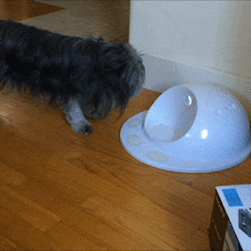
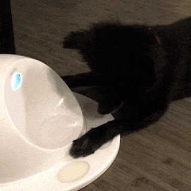
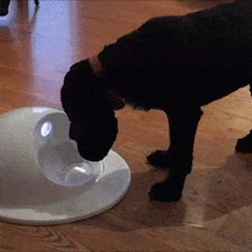
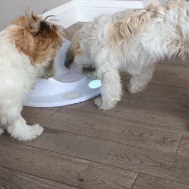
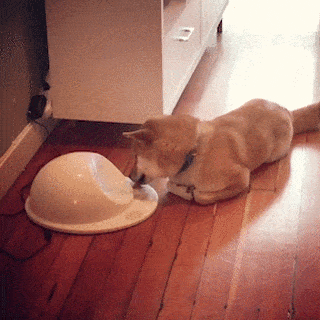
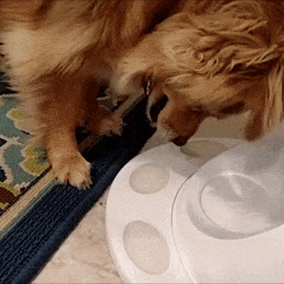
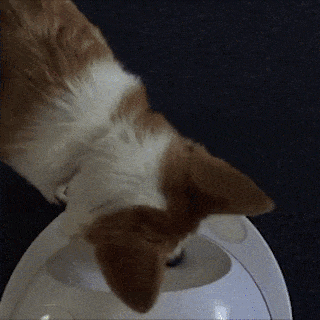
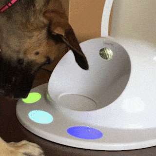
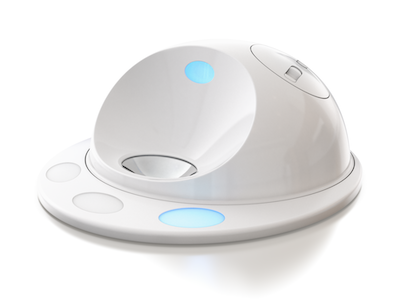

# hackerpet games repository

This is a compilation of games for [hackerpet][hackerpet_repo]-modified
CleverPet Hubs. You'll find here games to try out with your dog or cat. 
Feel free to suggest modifications to games or even add new games here that 
you've made yourself!

### Games to Teach your Player (dog, cat, pig, ...) to Use CleverPet
   CleverPet developed this sequence of games to teach players to use the CleverPet Hub's 
   touch interface, and are best played in the order below. When the player becomes proficient
   at the current challenge, switch them to the next one!

   |||&nbsp;&nbsp;&nbsp;&nbsp;|||
   |:---|:---|:-:|:---|---|
   | 0.  | [**EatingTheFood**](./games/000_EatingTheFood)  CleverPet&nbsp;<info@clever.pet> |[][EatingTheFood]| Help your player get comfortable with the Hub’s sounds and movements. |  |
   | 1.  | [**ExploringTheTouchpads**](./games/001_ExploringTheTouchpads)  CleverPet&nbsp;<info@clever.pet> |[][ExploringTheTouchpads]| A foodtreat is offered, but the player will also earn a reward when they press a touchpad.  |  |
   | 2.  | [**EngagingConsistently**](./games/002_EngagingConsistently)  CleverPet&nbsp;<info@clever.pet> |[][EngagingConsistently]| Now your player will need to press a touchpad to earn a reward.  |  |
   | 3.  | [**AvoidingUnlitTouchpads**](./games/003_AvoidingUnlitTouchpads)  CleverPet&nbsp;<info@clever.pet> |[][AvoidingUnlitTouchpads]| Your player must learn that only pressing illuminated touchpads results in success.  |  |
   | 4.  | [**LearningTheLights**](./games/004_LearningTheLights)  CleverPet&nbsp;<info@clever.pet> |[][LearningTheLights]| Only one touchpad is illuminated in this challenge.  |  |
   | 5.  | [**MasteringTheLights**](./games/005_MasteringTheLights)  CleverPet&nbsp;<info@clever.pet> |[][MasteringTheLights]| Only one lit touchpad, and now your player will need to engage even more consistently.  |  |
   | 6.  | [**RespondingQuickly**](./games/006_RespondingQuickly)  CleverPet&nbsp;<info@clever.pet> |[][RespondingQuickly]| Your player now has to press two touchpads in a row to solve one puzzle.  |  |
   | 7.  | [**LearningBrightness**](./games/007_LearningBrightness)  CleverPet&nbsp;<info@clever.pet> |[][LearningBrightness]| After the first press, your player will need to choose the brightest touchpad.  |  |
   | 8.  | [**LearningDoubleSequences**](./games/008_LearningDoubleSequences)  CleverPet&nbsp;<info@clever.pet> |[][LearningDoubleSequences]| Your player must press the brightest touchpad accurately twice in a row.  |  |
   | 9.  | [**LearningLongerSequences**](./games/009_LearningLongerSequences)  CleverPet&nbsp;<info@clever.pet> |[][LearningLongerSequences]| Your player is challenged to complete patterns of up to nine moves in a row.  |  |
   | 10. | [**MatchingTwoColors**](./games/010_MatchingTwoColors)  CleverPet&nbsp;<info@clever.pet> |[][MatchingTwoColors]| The Hub introduces colors, your player’s job is to make all the touchpads match.  |  |
   | 11. | [**MatchingMoreColors**](./games/011_MatchingMoreColors)  CleverPet&nbsp;<info@clever.pet> |[][MatchingMoreColors]| This challenge adds white to the mix, the number of solutions grows exponentially!  |  |

### Community Contributed Games
   Anyone can make a game for the Hub! If you'd like to add yours below, just create a pull 
   request to this repository. We'll commit all appropriate games. 

   ||||||
   |:---|:---|:-:|:---|---|
   | 12. | [**hello-animal**](./games/012_hello-animal)  CleverPet&nbsp;<info@clever.pet>|[][hello-animal]| An introduction to the basics of building hackerpet interactions. |  |
   | 13. | [**OneTwoThreeButtonGame**](./games/013_OneTwoThreeButtonGame)  CleverPet&nbsp;<info@clever.pet>|[][OneTwoThreeButtonGame]| This game can be useful during initial training of a player to use the Hub. |  |
   | 14. | [**ColorMatchGame**](./games/014_ColorMatchGame)  CleverPet&nbsp;<info@clever.pet>|[][ColorMatchGame]| Touching a touchpad toggles it to a different color, the game ends when all the touchpad colors match. |  |
   | 15. | [**WhackAMole**](./games/015_WhackAMole)  CleverPet&nbsp;<info@clever.pet>|[][WhackAMole]| This is a more "active" game for the Hub that challenges your player's "paw-eye" coordination. |  |
   | 16. | [**ControlPet**](./games/016_ControlPet)  Michael Gschwandtner&nbsp;<mgschwan -at- gmail.com> | [][ControlPet] | Remote control app for the hub. Control the hub either via a webinterface or from a python program. Enables rapid prototyping of new ideas and guided learning of the hub |  |
   | 17. | [**Simon**](./games/017_Simon)  Jelmer&nbsp;Tiete&nbsp;<jelmer@tiete.be> | [][Simon] | The classic Simon game, but now for your pet! |  |

--------

## How to install games

Once you've modified your Hub to work with hackerpet, the easiest way is to install a game is to just click the install icon ()! You'll then sign in to Particle and can choose which Photon you'd like to put the game on to. 

Alternatively, you can clone or download this repository, and then install the game to your Hub using one of:
   1. [particle-cli][particle_cli], 
   2. [Particle IDE (DEV)][particle_dev] (slightly easier to use), or
   3. [Particle Workbench][particle_vsc] (more sophisticated) for Visual Studio Code

## How to submit games

You can add your own game to this list by simply submitting a pull request (PR) in
this repository.
A few guidelines for assuring a quick PR approval:
* Please make sure you've tested the game and that you've succeeded at training a player to play it! 
* Please make sure that the game/app isn't a duplicate of others already here
* In your PR, make sure you update both this file and [games.json][games.json]
* Please submit one game per PR :)
* Ensure you've already completed the [CleverPet Individual
Contributor License Agreement (CLA)][CLA], which is based on the Google CLA. 

If you want to also include your source in this repository, you can make a new folder 
under the [games folder][games_folder] named after your game. The directory structure of
your game should follow the standard Particle project structure. You can see an
example of the structure in the [`hello-world`][hello_world] game folder.

## What's the CleverPet Hub? What's hackerpet? 

The [CleverPet Hub][cleverpet.io] is a programmable device that lets you
automatically train and interact with other species. It's kind of like a "game
console for dogs and cats".

  

The Hub is built on the [Particle][particle.io] platform, and with **hackerpet** 
we've open-sourced CleverPet's player-training software, which means that the full 
suite of tools Particle has built can be used to control the CleverPet Hub. 

You can find the main Particle library to control the CleverPet Hub in the
[hackerpet repository][hackerpet_repo] or on the
[build.particle.io][particle_lib] website.

## Glossary

In the hackerpet libraries words such as "challenge", "interaction" etc. are used
in specific ways:

*  **Player:** Any dog, cat, person, or other animal who is playing with a Hub.

*  **Foodtreat:** A food reward. E.g., a dog treat, cat treat, or piece of
   kibble.

*  **Report:** A single row of data describing everything that a player did
   during an interaction.

*  **Interaction:** A presentation of lights, sounds from a Hub, and the
   corresponding responses of a player, ending with a report. Nearly always, an
   interaction begins with the Hub doing some things, the player doing some
   things in response, and then the player getting some feedback as to whether
   they did the right thing.

*  **Challenge:** A series of one or more interactions, usually of progressively
   increasing difficulty, and often designed to teach the player a particular
   skill. *Example: the Responding Quickly challenge where the pet has to go
   through several iterations of pushing multiple lit up buttons and getting
   foodtreats.*

*  **Challenge set:** A series of challenges, such as the collection of 13
   original CleverPet challenges.

*  **Level:** A stage of difficulty within a given challenge. Lower levels are
   easier, and each challenge usually has a fixed number of them.

*  **Game:** A fuzzy term, currently without precise technical definition,
   sometimes used interchangeably with "challenge", but which may consist of
   multiple challenges.

[hub]: https://github.com/CleverPet/HackerPet/blob/master/docs/images/hub1.png "Hackerpet hub"
[cleverpet.io]: https://clever.pet/ "CleverPet website"
[hackerpet_repo]: https://github.com/Cleverpet/HackerPet/ "hackerpet repository"
[particle_lib]: https://build.particle.io/libs/hackerpet/0.2.2/tab/hackerpet.cpp "hackerpet library"
[particle_cli]: https://docs.particle.io/tutorials/developer-tools/cli/ "Particle CLI"
[particle_dev]: https://docs.particle.io/tutorials/developer-tools/dev/
[particle_vsc]: https://www.particle.io/workbench/ "Particle workbench"
[build.particle]: https://build.particle.io "Particle build environment"
[games.json]: ./games.json "JSON games list"
[games_folder]: ./games/ "games folder"
[hello_world]: ./games/hello-world "Example game"
[particle.io]: https://particle.io/ "Particle website"
[CLA]: https://docs.google.com/forms/d/e/1FAIpQLSeXAajtFZpQ0VtHK2APtfzrA5w8DMNagJhCfLVr6h9lCQgj1g/viewform "Contributor License Agreement"

[EatingTheFood]:           https://install.hackerpet.com/?name=EatingTheFood&f=https://raw.githubusercontent.com/CleverPet/hackerpet-games/master/games/000_EatingTheFood/src/EatingTheFood.cpp&f=https://raw.githubusercontent.com/CleverPet/hackerpet-games/master/games/000_EatingTheFood/project.properties
[ExploringTheTouchpads]:   https://install.hackerpet.com/?name=ExploringTheTouchpads&f=https://raw.githubusercontent.com/CleverPet/hackerpet-games/master/games/001_ExploringTheTouchpads/src/ExploringTheTouchpads.cpp&f=https://raw.githubusercontent.com/CleverPet/hackerpet-games/master/games/001_ExploringTheTouchpads/project.properties
[EngagingConsistently]:    https://install.hackerpet.com/?name=EngagingConsistently&f=https://raw.githubusercontent.com/CleverPet/hackerpet-games/master/games/002_EngagingConsistently/src/EngagingConsistently.cpp&f=https://raw.githubusercontent.com/CleverPet/hackerpet-games/master/games/002_EngagingConsistently/project.properties
[AvoidingUnlitTouchpads]:  https://install.hackerpet.com/?name=AvoidingUnlitTouchpads&f=https://raw.githubusercontent.com/CleverPet/hackerpet-games/master/games/003_AvoidingUnlitTouchpads/src/AvoidingUnlitTouchpads.cpp&f=https://raw.githubusercontent.com/CleverPet/hackerpet-games/master/games/003_AvoidingUnlitTouchpads/project.properties
[LearningTheLights]:       https://install.hackerpet.com/?name=LearningTheLights&f=https://raw.githubusercontent.com/CleverPet/hackerpet-games/master/games/004_LearningTheLights/src/LearningTheLights.cpp&f=https://raw.githubusercontent.com/CleverPet/hackerpet-games/master/games/004_LearningTheLights/project.properties
[MasteringTheLights]:      https://install.hackerpet.com/?name=MasteringTheLights&f=https://raw.githubusercontent.com/CleverPet/hackerpet-games/master/games/005_MasteringTheLights/src/MasteringTheLights.cpp&f=https://raw.githubusercontent.com/CleverPet/hackerpet-games/master/games/005_MasteringTheLights/project.properties
[RespondingQuickly]:       https://install.hackerpet.com/?name=RespondingQuickly&f=https://raw.githubusercontent.com/CleverPet/hackerpet-games/master/games/006_RespondingQuickly/src/RespondingQuickly.cpp&f=https://raw.githubusercontent.com/CleverPet/hackerpet-games/master/games/006_RespondingQuickly/project.properties
[LearningBrightness]:      https://install.hackerpet.com/?name=LearningBrightness&f=https://raw.githubusercontent.com/CleverPet/hackerpet-games/master/games/007_LearningBrightness/src/LearningBrightness.cpp&f=https://raw.githubusercontent.com/CleverPet/hackerpet-games/master/games/007_LearningBrightness/project.properties
[LearningDoubleSequences]: https://install.hackerpet.com/?name=LearningDoubleSequences&f=https://raw.githubusercontent.com/CleverPet/hackerpet-games/master/games/008_LearningDoubleSequences/src/LearningDoubleSequences.cpp&f=https://raw.githubusercontent.com/CleverPet/hackerpet-games/master/games/008_LearningDoubleSequences/project.properties
[LearningLongerSequences]: https://install.hackerpet.com/?name=LearningLongerSequences&f=https://raw.githubusercontent.com/CleverPet/hackerpet-games/master/games/009_LearningLongerSequences/src/LearningLongerSequences.cpp&f=https://raw.githubusercontent.com/CleverPet/hackerpet-games/master/games/009_LearningLongerSequences/project.properties
[MatchingTwoColors]:       https://install.hackerpet.com/?name=MatchingTwoColors&f=https://raw.githubusercontent.com/CleverPet/hackerpet-games/master/games/010_MatchingTwoColors/src/MatchingTwoColors.cpp&f=https://raw.githubusercontent.com/CleverPet/hackerpet-games/master/games/010_MatchingTwoColors/project.properties
[MatchingMoreColors]:      https://install.hackerpet.com/?name=MatchingMoreColors&f=https://raw.githubusercontent.com/CleverPet/hackerpet-games/master/games/011_MatchingMoreColors/src/MatchingMoreColors.cpp&f=https://raw.githubusercontent.com/CleverPet/hackerpet-games/master/games/011_MatchingMoreColors/project.properties
[hello-animal]:            https://install.hackerpet.com/?name=hello-animal&f=https://raw.githubusercontent.com/CleverPet/hackerpet-games/master/games/012_hello-animal/src/hello-animal.cpp&f=https://raw.githubusercontent.com/CleverPet/hackerpet-games/master/games/012_hello-animal/project.properties
[OneTwoThreeButtonGame]:   https://install.hackerpet.com/?name=OneTwoThreeButtonGame&f=https://raw.githubusercontent.com/CleverPet/hackerpet-games/master/games/013_OneTwoThreeButtonGame/src/OneTwoThreeButtonGame.cpp&f=https://raw.githubusercontent.com/CleverPet/hackerpet-games/master/games/013_OneTwoThreeButtonGame/project.properties
[ColorMatchGame]:          https://install.hackerpet.com/?name=ColorMatchGame&f=https://raw.githubusercontent.com/CleverPet/hackerpet-games/master/games/014_ColorMatchGame/src/ColorMatchGame.cpp&f=https://raw.githubusercontent.com/CleverPet/hackerpet-games/master/games/014_ColorMatchGame/project.properties
[WhackAMole]:              https://install.hackerpet.com/?name=WhackAMole&f=https://raw.githubusercontent.com/CleverPet/hackerpet-games/master/games/015_WhackAMole/src/WhackAMole.cpp&f=https://raw.githubusercontent.com/CleverPet/hackerpet-games/master/games/015_WhackAMole/project.properties
[ControlPet]:              https://install.hackerpet.com/?name=ControlPet&f=https://raw.githubusercontent.com/CleverPet/hackerpet-games/master/games/016_ControlPet/SocketIOclient.cpp&f=https://raw.githubusercontent.com/CleverPet/hackerpet-games/master/games/016_ControlPet/SocketIOclient.h&f=https://raw.githubusercontent.com/CleverPet/hackerpet-games/master/games/016_ControlPet/WebSockets.cpp&f=https://raw.githubusercontent.com/CleverPet/hackerpet-games/master/games/016_ControlPet/WebSockets.h&f=https://raw.githubusercontent.com/CleverPet/hackerpet-games/master/games/016_ControlPet/WebSocketsClient.cpp&f=https://raw.githubusercontent.com/CleverPet/hackerpet-games/master/games/016_ControlPet/WebSocketsClient.h&f=https://raw.githubusercontent.com/CleverPet/hackerpet-games/master/games/016_ControlPet/WebSocketsServer.cpp&f=https://raw.githubusercontent.com/CleverPet/hackerpet-games/master/games/016_ControlPet/WebSocketsServer.h&f=https://raw.githubusercontent.com/CleverPet/hackerpet-games/master/games/016_ControlPet/cdecode.c&f=https://raw.githubusercontent.com/CleverPet/hackerpet-games/master/games/016_ControlPet/cdecode_inc.h&f=https://raw.githubusercontent.com/CleverPet/hackerpet-games/master/games/016_ControlPet/cencode.h&f=https://raw.githubusercontent.com/CleverPet/hackerpet-
games/master/games/016_ControlPet/cencode_inc.h&f=https://raw.githubusercontent.com/CleverPet/hackerpet-games/master/games/016_ControlPet/controlpet.cpp&f=https://raw.githubusercontent.com/CleverPet/hackerpet-games/master/games/016_ControlPet/controlpet_util.cpp&f=https://raw.githubusercontent.com/CleverPet/hackerpet-games/master/games/016_ControlPet/controlpet_util.h&f=https://raw.githubusercontent.com/CleverPet/hackerpet-games/master/games/016_ControlPet/libsha1.c&f=https://raw.githubusercontent.com/CleverPet/hackerpet-games/master/games/016_ControlPet/libsha1.h&f=https://raw.githubusercontent.com/CleverPet/hackerpet-games/master/games/016_ControlPet/project.properties
[Simon]:                   https://install.hackerpet.com/?name=Simon&f=https://raw.githubusercontent.com/CleverPet/hackerpet-games/master/games/017_Simon/src/simon.cpp&f=https://raw.githubusercontent.com/CleverPet/hackerpet-games/master/games/017_Simon/project.properties
