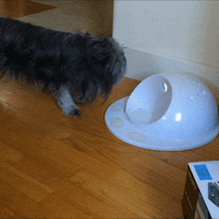
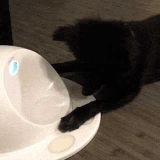
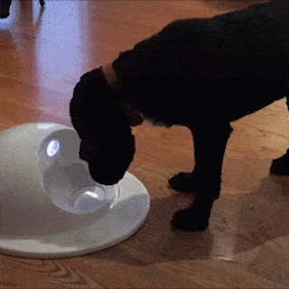
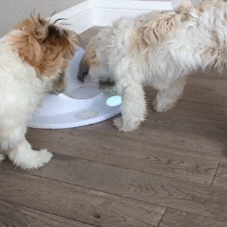
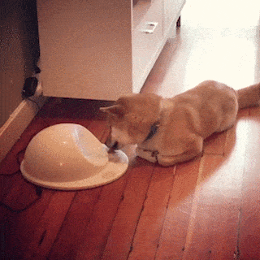
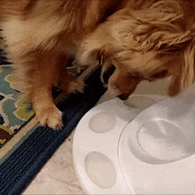
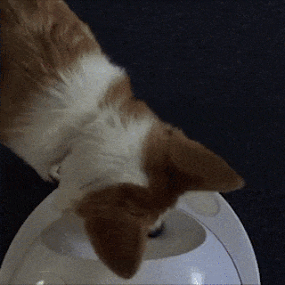
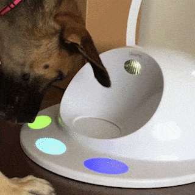

# hackerpet Games List

* ### Getting started games
   These games are examples to get you started making your own games!
   * [**hello-world**](./games/hello-world) - Example game for the hackerpet hub, hosted on the hackerpet-games repository.  
      CleverPet <info@clever.pet>

   * [**hello-animal**](./games/hello-animal) - An introduction to the basics of building hackerpet
        interactions.  
      CleverPet <info@clever.pet>

* ### Standard Curriculum
   These games are developed to get your player accustomed with the hackerpet
   hub and are best played in this order. 
   When the player becomes proficient at the current challenge, they can upgrade
   to the next one!  

   | | |  |  |
   |:---|:--- | :--- | ---: |
   | 0\. | [**EatingTheFood**](./games/EatingTheFood) | Help your player get comfortable with the Hub’s sounds and movements. |  |
   | 1\. | [**ExploringTheTouchpads**](./games/ExploringTheTouchpads) | A foodtreat is offered, but the player will also earn a reward when they press a touchpad.  |  |
   | 2\. | [**EngagingConsistently**](./games/EngagingConsistently) | Now your player will need to press a touchpad to earn a reward.  |  |
   | 3\. | [**AvoidingUnlitTouchpads**](./games/AvoidingUnlitTouchpads) | Your player must learn that only pressing illuminated touchpads results in success.  |  |
   | 4\. | [**LearningTheLights**](./games/LearningTheLights) | Only one touchpad is illuminated in this challenge.  |  |
   | 5\. | [**MasteringTheLights**](./games/MasteringTheLights) | Only one lit touchpad, and now your player will need to engage even more consistently.  |  |
   | 6\. | [**RespondingQuickly**](./games/RespondingQuickly) | Your player now has to press two touchpads in a row to solve one puzzle.  |  |
   | 7\. | [**LearningBrightness**](./games/LearningBrightness) | After the first press, your player will need to choose the brightest touchpad.  |  |
   | 8\. | [**LearningDoubleSequences**](./games/LearningDoubleSequences) | Your player must press the brightest touchpad accurately twice in a row.  |  |
   | 9\. | [**LearningLongerSequences**](./games/LearningLongerSequences) | Your player is challenged to complete patterns of up to nine moves in a row.  |  |
   | 10\.|  [**MatchingTwoColors**](./games/MatchingTwoColors) | The Hub introduces colors, your player’s job is to make all the touchpads match.  |  |
   | 11\.|  [**MatchingMoreColors**](./games/MatchingMoreColors) | This challenge adds white to the mix, the number of solutions grows exponentially!  |  |

   0\. [**EatingTheFood**](./games/EatingTheFood) - Help your player get comfortable with the Hub’s sounds and movements.  
   &nbsp;&nbsp;&nbsp;&nbsp;CleverPet info@clever.pet  

   1\. [**ExploringTheTouchpads**](./games/ExploringTheTouchpads) - A foodtreat is offered, but the player will also earn a reward when they press a touchpad.  
   &nbsp;&nbsp;&nbsp;&nbsp;CleverPet info@clever.pet

   2\. [**EngagingConsistently**](./games/EngagingConsistently) - Now your player will need to press a touchpad to earn a reward.  
   &nbsp;&nbsp;&nbsp;&nbsp;CleverPet info@clever.pet

   3\. [**AvoidingUnlitTouchpads**](./games/AvoidingUnlitTouchpads) - Your player must learn that only pressing illuminated touchpads results in success.  
   &nbsp;&nbsp;&nbsp;&nbsp;CleverPet info@clever.pet

   4\. [**LearningTheLights**](./games/LearningTheLights) - Only one touchpad is illuminated in this challenge.  
   &nbsp;&nbsp;&nbsp;&nbsp;CleverPet info@clever.pet

   5\. [**MasteringTheLights**](./games/MasteringTheLights) - Only one lit touchpad, and now your player
    will need to engage even more consistently.  
   &nbsp;&nbsp;&nbsp;&nbsp;CleverPet info@clever.pet

   6\. [**RespondingQuickly**](./games/RespondingQuickly) - Your player now has
    to press two touchpads in a row to solve one puzzle.  
   &nbsp;&nbsp;&nbsp;&nbsp;CleverPet info@clever.pet

   7\. [**LearningBrightness**](./games/LearningBrightness) - After the first press, your player will need to choose the brightest touchpad.  
   &nbsp;&nbsp;&nbsp;&nbsp;CleverPet info@clever.pet

   8\. [**LearningDoubleSequences**](./games/LearningDoubleSequences) - Your player must press the brightest touchpad accurately twice in a row.  
   &nbsp;&nbsp;&nbsp;&nbsp;CleverPet info@clever.pet

   9\. [**LearningLongerSequences**](./games/LearningLongerSequences) - Your player is challenged to complete patterns of up to nine moves in a row.  
   &nbsp;&nbsp;&nbsp;&nbsp;CleverPet info@clever.pet

   10\. [**MatchingTwoColors**](./games/MatchingTwoColors) - The Hub introduces colors, your player’s job is to make all
    the touchpads match.  
   &nbsp;&nbsp;&nbsp;&nbsp;CleverPet info@clever.pet

   11\. [**MatchingMoreColors**](./games/MatchingMoreColors) - This challenge adds white to the mix, the number of solutions grows exponentially!  
   &nbsp;&nbsp;&nbsp;&nbsp;CleverPet info@clever.pet

* ### Community Submitted Games
   These games were submitted by the community, you can too! Just create a pull request in this repository.
   * [**WhackAMole**](https://go.particle.io/shared_apps/5d6229549628d800059f724d) (hosted on build.particle.io) - This is a more "active" game for the Hub that challenges your player's
     "paw-eye" coordination.  
   CleverPet <info@clever.pet>
   * [**WhackAMole**](./games/WhackAMole) - This is a more "active" game for the Hub that challenges your player's
     "paw-eye" coordination.  
   CleverPet <info@clever.pet>
   * [**ColorMatchGame**](./games/ColorMatchGame) - Touching a touchpad toggles it to a different color, the game ends when all the touchpad colors match.  
   CleverPet <info@clever.pet>
   * [**OneTwoThreeButtonGame**](./games/OneTwoThreeButtonGame) - This game can be useful during initial training of a player to use the Hub.  
   CleverPet <info@clever.pet>

--------

# hackerpet Games

The [CleverPet Hub][cleverpet.io] is a programmable device that lets you
automatically train and interact with other species. It's kind of like a "game
console for pets".

  

The Hub is built on the [Particle][particle.io] platform, which means that the
full suite of tools Particle has built can be used to control the CleverPet Hub.

You can find the main Particle library to control the CleverPet hub in the
[hackerpet repository][hackerpet_repo] or on the
[build.particle.io][particle_lib] website.

This repository holds all the community submitted games that can be installed on
the hackerpet hub.

## How to install games

You can find the full list of available games in [games.md][games.md]. (a
computer readable list can be found in [games.json][games.json])  
The actual source code of the games can live in one of two places: either on
[build.particle.io][build.particle] or in this repository under the
[games][games_folder] folder.

Once you picked your game and clicked on its link you can end up:
*  on build.particle.io  
   Now you just click the `Copy This App` button and then hit the lightning bolt
   icon in the top left to install the game on your hub.
*  in the games folder in this repository  
   To install this game you'll have to first clone or download this repository.
   Then you can use the [particle-cli][particle_cli] or [Particle
   workbench][particle_vsc] for VSC to send the new game to your hub.

## How to submit games

You can add your own game to this list by simply submitting a pull request in
this repository.  
Make sure you update both the [games.md][games.md] and the
[games.json][games.json] files. If you want to also include your source in this
repository, you can make a new folder under the [games folder][games_folder]
named after your game. The directory structure of your game should follow the
standard Particle project structure. You can see an example of the structure in
the [`hello-world`][hello_world] game folder.

## Definitions

In the hackerpet libraries words such as "challenge", "interaction" etc. are used
in specific ways:

*  **Player:** Any dog, cat, person, or other animal who is playing with a Hub.

*  **Foodtreat:** A food reward. E.g., a dog treat, cat treat, or piece of
   kibble.

*  **Report:** A single row of data describing everything that a player did
   during an interaction.

*  **Interaction:** A presentation of lights, sounds from a Hub, and the
   corresponding responses of a player, ending with a report. Nearly always, an
   interaction begins with the Hub doing some things, the player doing some
   things in response, and then the player getting some feedback as to whether
   they did the right thing.

*  **Challenge:** A series of one or more interactions, usually of progressively
   increasing difficulty, and often designed to teach the player a particular
   skill. *Example: the Responding Quickly challenge where the pet has to go
   through several iterations of pushing multiple lit up buttons and getting
   foodtreats.*

*  **Challenge set:** A series of challenges, such as the collection of 13
   original CleverPet challenges.

*  **Level:** A stage of difficulty within a given challenge. Lower levels are
   easier, and each challenge usually has a fixed number of them.

*  **Game:** A fuzzy term, currently without precise technical definition,
   sometimes used interchangeably with "challenge", but which may consist of
   multiple challenges.

## Contributing

This is where things can get really fun. Want to add a new game, and perhaps see
how the community, or dogs, or cats, respond to it? Create your own fork and
submit a pull request. We'll chat about it as a community, and if it seems
sensible we'll add it to the collection of games!

To make this work, all contributors first have to sign the [CleverPet Individual
Contributor License Agreement (CLA)][CLA], which is based on the Google CLA.
This agreement provides the CleverPet team with a license to re-distribute your
contributions.

Whenever possible, please follow these contribution guidelines:
- Keep each pull request small and focused on a single game, feature, or bug
  fix.
- Familiarize yourself with the code base, and follow the formatting principles
  adhered to in the surrounding code.

[hub]: https://github.com/CleverPet/HackerPet/blob/master/docs/images/hub1.png "Hackerpet hub"
[cleverpet.io]: https://clever.pet/ "CleverPet website"
[hackerpet_repo]: https://github.com/Cleverpet/HackerPet/ "hackerpet repository"
[particle_lib]: https://build.particle.io/libs/hackerpet/0.2.2/tab/hackerpet.cpp "hackerpet library"
[particle_cli]: https://docs.particle.io/tutorials/developer-tools/cli/ "Particle CLI"
[particle_vsc]: https://www.particle.io/workbench/ "Particle workbench"
[build.particle]: https://build.particle.io "Particle build environment"
[games.md]: ./games.md "Readable games list"
[games.json]: ./games.json "JSON games list"
[games_folder]: ./games/ "games folder"
[hello_world]: ./games/hello-world "Example game"
[particle.io]: https://particle.io/ "Particle website"
[CLA]: https://docs.google.com/forms/d/e/1FAIpQLSeXAajtFZpQ0VtHK2APtfzrA5w8DMNagJhCfLVr6h9lCQgj1g/viewform "Contributor License Agreement"

